Mint tools
==========

The first Mint tools were developed around 2006 when the Linux Mint project was born. Throughout the years, new tools were added to Linux Mint to implement functions that it was missing, or to make the user experience easier and more comfortable.

Some tools, which were very useful in the past, also disappeared when they were no longer needed. Here's a list of the currently active tools projects developed by Linux Mint.

mint-common
-----------

Common utility functions and libraries used by the Mint tools are placed in the mint-common project.

This project is developed in Python and its source code is available on `Github <https://github.com/linuxmint/mint-common>`_.

mintbackup
----------

The `Backup Tool`, mintbackup, makes it easy to save and restore backups of files within the home directory.

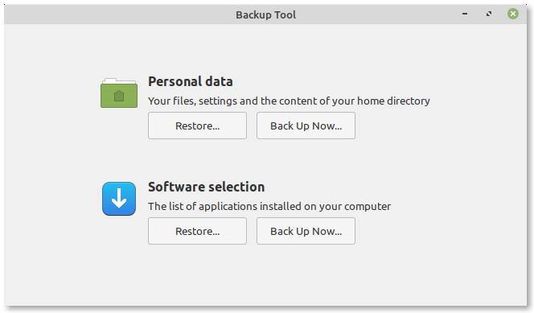

    Backup Tool

It also supports the ability to save the list of installed packages, so they can be reinstalled later.

This project is developed in Python and its source code is available on `Github <https://github.com/linuxmint/mintbackup>`_.

mintdesktop
-----------

This is a tool which provides some additional settings for the MATE desktop environment and the ability to switch window managers.

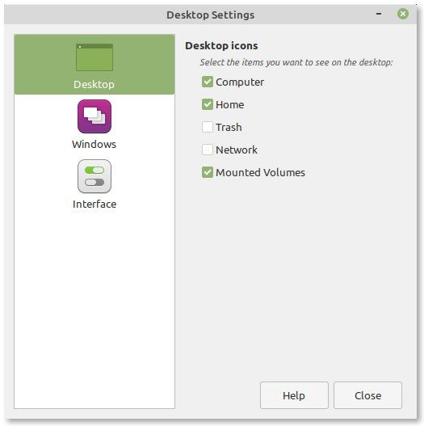

    Desktop Settings

This project is developed in Python and its source code is available on `Github <https://github.com/linuxmint/mintdesktop>`_.

mintdrivers
-----------

The `Driver Manager`, mintdrivers, makes it easy to install proprietary drivers when applicable.

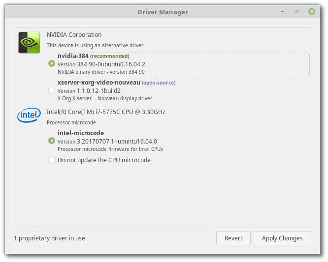

    Driver Manager

It relies on the `ubuntu-drivers` backend and isn't available in LMDE.

This project is developed in Python and its source code is available on `Github <https://github.com/linuxmint/mintdrivers>`_.

mintinstall
-----------

The `Software Manager`, mintinstall, is an App store for Free Software. It provides access to popular applications from within the repository.

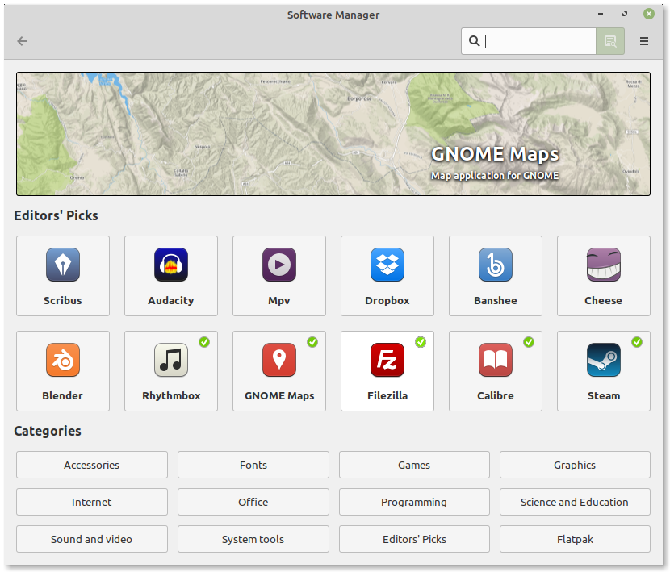

    Software Manager

It's also compatible with Flatpak and able to list flatpaks from multiple flatpak repositories.

This project is developed in Python and its source code is available on `Github <https://github.com/linuxmint/mintinstall>`_.

mintlocale
----------

The mintlocale project provides two configuration tools.

The first one is dedicated to locale selection and installation.

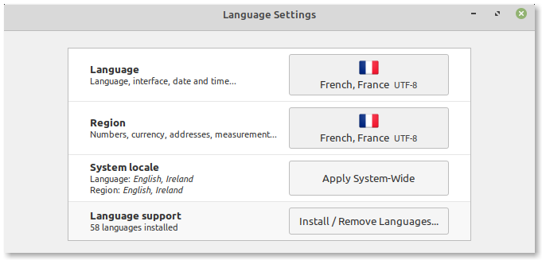

    Language Settings

The second one is dedicated to input methods:

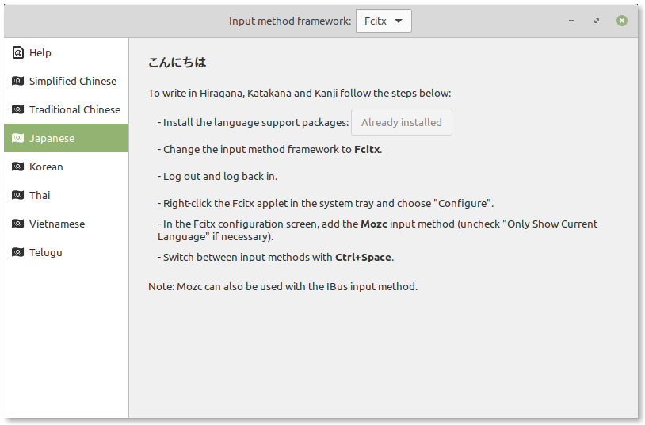

    Input Methods

This project is developed in Python and its source code is available on `Github <https://github.com/linuxmint/mintlocale>`_.

mintmenu
--------

This is the main application menu for the MATE edition of Linux Mint.

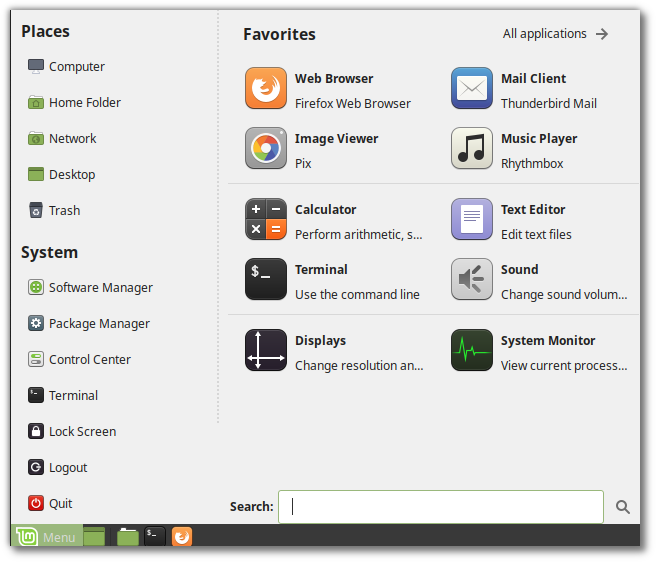

    MintMenu

This project is developed in Python and its source code is available on `Github <https://github.com/linuxmint/mintmenu>`_.

mintnanny
---------

The `Domain Blocker`, mintnanny, blocks outgoing traffic towards chosen domain names using /etc/hosts.

    Domain Blocker

This project is developed in Python and its source code is available on `Github <https://github.com/linuxmint/mintnanny>`_.

mintreport
----------

The `System Reports`, mintreport, provides system information and helps the user collect information about application crashes.

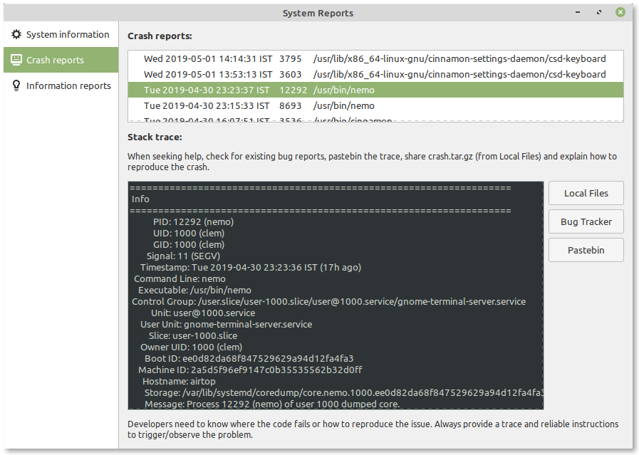

    System Reports

This project is developed in Python and its source code is available on `Github <https://github.com/linuxmint/mintreport>`_.

mintsources
-----------

The `Software Sources` configuration tool, mintsources, helps the user configure software repositories, choose a mirror, add PPAs and perform maintenance tasks related to package management.

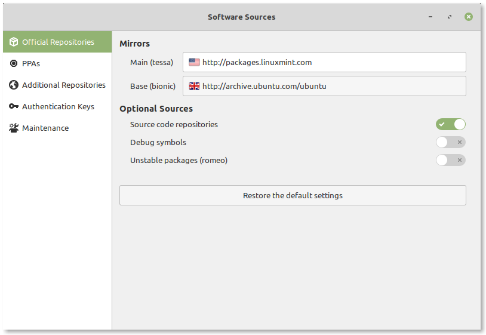

    Software Sources Configuration Tool

This project is developed in Python and its source code is available on `Github <https://github.com/linuxmint/mintsources>`_.

mintstick
---------

The mintstick project provides two utilities.

The first one is dedicated to formatting USB sticks.

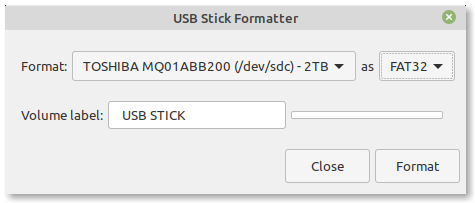

    USB Stick Formatter

The second one is used to make live USB sticks from ISO images:

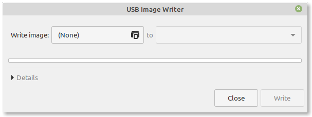

    USB Image Writer

This project is developed in Python and its source code is available on `Github <https://github.com/linuxmint/mintstick>`_.

mintsystem
----------

This project provides small utilities, as well as files, scripts and resources used by the OS.

mintupdate
----------

The `Update Manager`, mintupdate, provides users with software and security updates.

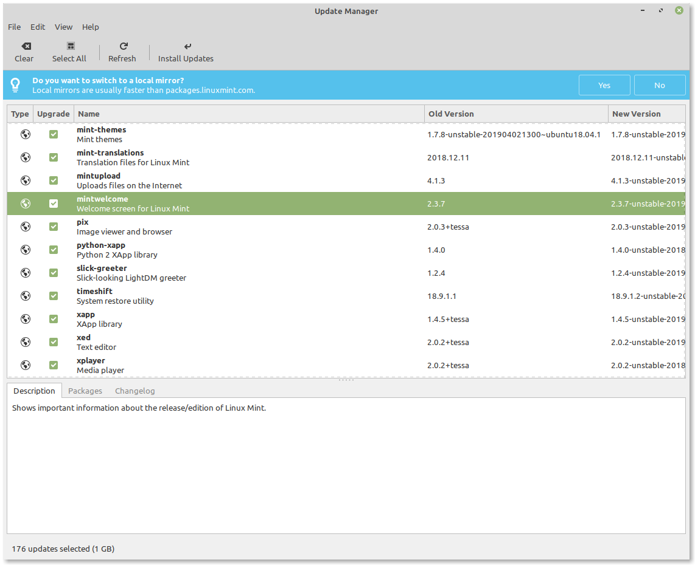

    Update Manager

This project is developed in Python and its source code is available on `Github <https://github.com/linuxmint/mintupdate>`_.

mintupload
----------

The `Upload Manager`, mintupload, allows the user to upload files to a particular location, without browsing it, just by dropping the files with the mouse.

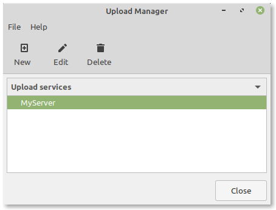

    Welcome Screen

This project is developed in Python and its source code is available on `Github <https://github.com/linuxmint/mintupload>`_.

mintwelcome
-----------

The `Welcome Screen`, mintwelcome, welcomes new users into Linux Mint and guides them through their first steps.

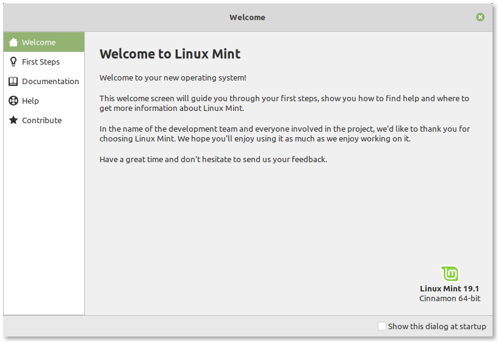

    Welcome Screen

This project is developed in Python and its source code is available on `Github <https://github.com/linuxmint/mintwelcome>`_.

