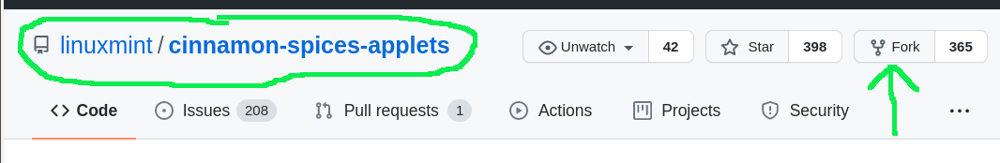
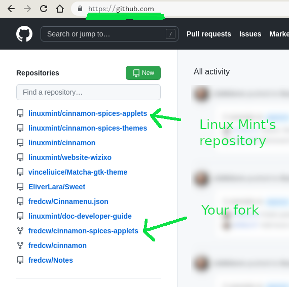
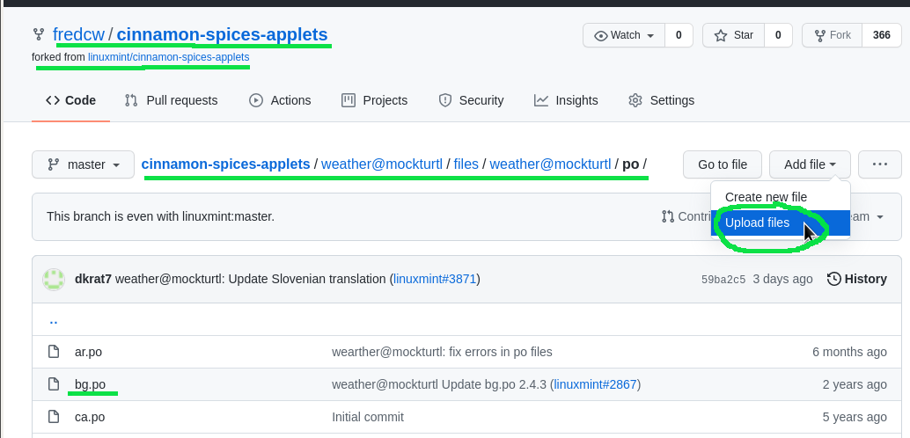
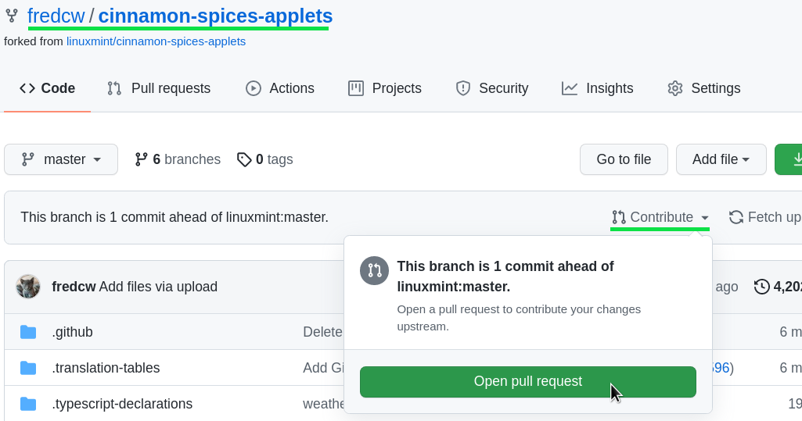
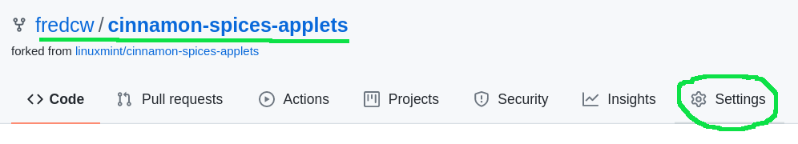

Cinnamon xlets (applets, desklets and extensions)
==================================================================

Translations for the default cinnamon xlets (the ones you don't have to download) are done on `Launchpad <https://translations.launchpad.net/linuxmint/latest/+pots/cinnamon>`_.

To add translations for third party applets, desklets and extensions, you first need to make the changes to your local copy of the xlet, test your changes and then make a github "pull request" so that your changes can benefit other users of the xlet.

Let's say for instance that you want to add some translations for the Weather applet. First find where the applet is stored - in this case you'll find it at ``~/.local/share/cinnamon/applets/weather@mockturtl``. In this directory is another directory called "po" where all the translations are found. There is a separate .po file for each language. These .po files are just text files which can be edited by hand in a text editor but most people use a program called poedit which is designed especially for editing these files. Poedit should be available in the software manager.

Using Poedit
------------

Once you've opened the relevant .po file in poedit, you first need to make sure that it is up to date and contains all the latest strings that need translating as it may not have been updated for a while. To do this, select Translation>Update from POT File... in the menu and select the .pot file that is in the same directory as the .po file you are editing, in this case it's "weather@mockturl.pot". You can now add your translations in poedit and save the file.

Note: Poedit may also save a .mo file in the same directory but this should be deleted. You can prevent poedit from saving a .mo file in the preferences.

Install the changes
-------------------

Once you've saved the file, you'll need to install it. Go to the directory containing the applet folder - in this case ``~/.local/share/cinnamon/applets`` and open a terminal. Enter the command:

.. code-block:: bash

   cinnamon-xlet-makepot weather@mockturtl --install

or replace "weather@mockturtl" with the name of the folder containing the applet you've added translations to. It should say: "installed 20 files" or however many .po files the applet has. Now restart cinnamon (Ctrl-Alt-Esc) and see your translations in the applet.

Note: More detailed instructions on this process (including instructions for applet developers) can be found `here <https://github.com/NikoKrause/CinnVIIStarkMenu/issues/19>`_.

Once you're happy with your changes you can upload your changed .po file to github to share with others.

Upload to Github
----------------

Making changes on Github is slightly more complicated than uploading a file on a normal website but it's fairly easy once you understand the basic concept. Instead of just uploading a file, you first have to "fork" the "repository" to which you want to make changes. This effectively means that you create your very own exact copy of Linux Mint's repository that now belongs to your github account. You then make changes to your copy of the repository, e.g. uploading your new version of your .po file.  When you're happy with the changes you've made, you then open a "pull request". This means that you're asking Linux Mint to "merge" or combine the changes you've made to your version of the repository with Linux Mint's version of the repository. Once your "pull request" has been accepted and merged by Linux Mint, you can then delete your copy of the repository ready to do the whole thing again when you want to make some more changes.

If all this seems a bit too complicated, you could always try emailing your updated .po file to the xlet's author and they will probably be happy to do this for you.

Using Github
------------

Lets say that you want to upload your new version of bg.po, the Bulgarian translation of the weather applet. Once you've created a github account, go to https://github.com/linuxmint/cinnamon-spices-applets and fork this respository.

    Fork a repository

You should then have your own copy of this repository.

    github.com

In your fork of the repository, navigate to the folder containing the file you want to update and click on Add file>Upload files or simply drag and drop your new file onto the page.

    Upload a file

You will then be asked to "Commit changes". Add a comment and click the "Commit changes" button.

You can now make a pull request:

    Make a pull request

You will then be presented with a page showing the changes you propose and a button to confirm the pull request "Create pull request".
That's it. All you have to do now is wait for Linux mint to review and merge your pull request. When this happens, you should recieve an email, after which you can safely delete your fork ready for the next time. You can delete your fork at the bottom of the settings page.

    Delete your fork

