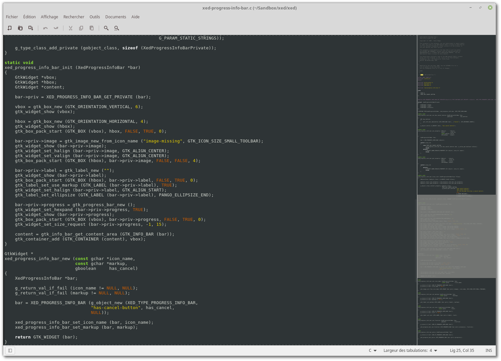
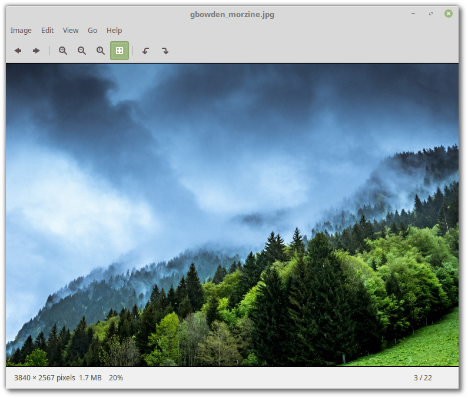
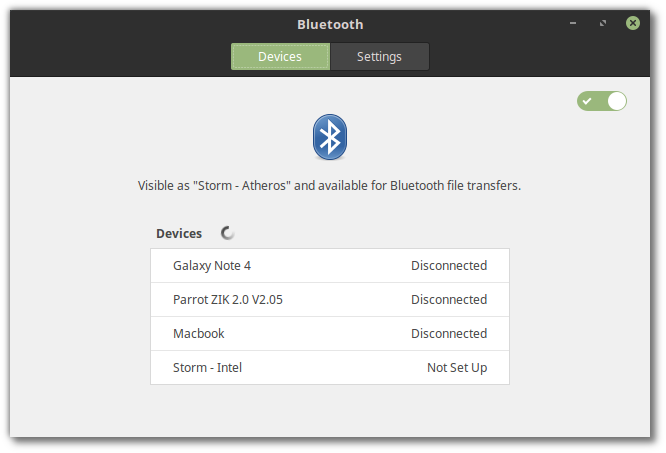
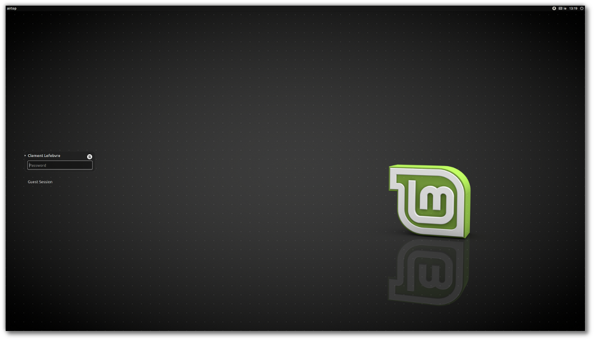
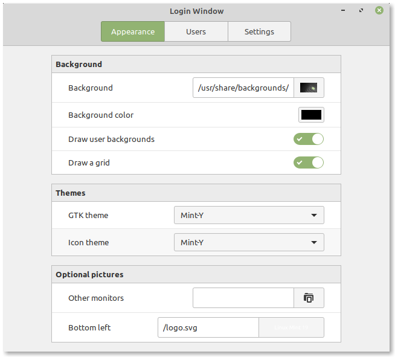

XApps
=====

A project called "X-Apps" was started in 2016 to produce generic applications for traditional GTK desktop environments.

The idea behind this project is to replace applications which no longer integrate properly outside of a particular environment (this is the case for a growing number of GNOME applications) and to give our desktop environments the same set of core applications, so that each change, each new feature being developed, each little improvement made in one of them will benefit not just one environment, but all of them.

The core ideas for X-Apps are:

- To use modern toolkits and technologies (GTK3 for HiDPI support, gsettings etc..)
- To use traditional user interfaces (titlebars, menubars)
- To work everywhere (to be generic, desktop-agnostic and distro-agnostic)
- To provide the functionality users already enjoy (or enjoyed in the past for distributions which already lost some functionality)
- To be backward-compatible (in order to work on as many distributions as possible)

Within Linux Mint, users didn't need to adapt to X-Apps, because in many cases, they were very similar or exactly the same as the applications people were already using. For instance, Totem 3.18 was radically different than Totem 3.10 which shipped with Linux Mint 17, but Xplayer 1.0 (which was the default media player in Linux Mint 18) was exactly the same. The goal of the X-Apps is not to reinvent the wheel. Quite the opposite in fact, it's to guarantee the maintenance of applications we already enjoyed and to steer their development in a direction that benefits multiple desktop environments.

It makes no sense to develop 3 different text editors, 5 different calculators and so on. When we work on projects like these, we want to make it count. An improvement in the text editor shouldn't benefit only one edition, it should benefit all of them.

All three editions of Linux Mint come with the same XApps libraries and applications. When working on XApps, our development efforts are focused on improving all desktops.

libxapp
-------

This is the XApps library. Anything that is cross-desktop goes in there.

It's available in Python and JS as well, through GObject Introspection.

This project is developed in C and its source code is available on `Github <https://github.com/linuxmint/xapps>`_.

python-xapp
-----------

This is a small Python library providing extra functionality.

This project is developed in Python and its source code is available on `Github <https://github.com/linuxmint/python-xapp>`_.

xed
---

Xed is based on Pluma and acts as the default text editor.

    Text Editor

This project is developed in C and its source code is available on `Github <https://github.com/linuxmint/xed>`_.

xviewer
-------

Xviewer is based on Eye of GNOME and acts as the default image viewer.

    Image Viewer

This project is developed in C and its source code is available on `Github <https://github.com/linuxmint/xviewer>`_.

xplayer
-------

Xplayer is based on Totem and acts as the default media player for music and videos.

    Multimedia Player

This project is developed in C and its source code is available on `Github <https://github.com/linuxmint/xplayer>`_.

xreader
-------

Xreader is based on Atril and acts as the default document and PDF reader.

    Document Viewer

This project is developed in C and its source code is available on `Github <https://github.com/linuxmint/xreader>`_.

pix
---

Pix is based on gThumb, which is an application to organize your photos.

    Pix

This project is developed in C and its source code is available on `Github <https://github.com/linuxmint/pix>`_.

blueberry
---------

The `Bluetooth` tool, blueberry, is a frontend to gnome-bluetooth with systray support.

    Bluetooth

The GNOME Bluetooth frontend was removed from gnome-bluetooth and made part of gnome-control-center, essentially making gnome-bluetooth useless outside of GNOME. Blueberry provides that missing frontend and makes it easy for other GTK desktops to use gnome-bluetooth.

This project is developed in Python and its source code is available on `Github <https://github.com/linuxmint/blueberry>`_.

slick-greeter
-------------

Slick-greeter is the default login screen, it's a LightDM greeter originally forked from `unity-greeter` and modified to work on its own (without gnome-settings-daemon, gnome or unity).

    Slick Greeter

This project is developed in Vala and its source code is available on `Github <https://github.com/linuxmint/slick-greeter>`_.

lightdm-settings
----------------

The lightdm-settings project provides a configuration tool to set up LightDM and slick-greeter.

    Login Window

This project is developed in Python and its source code is available on `Github <https://github.com/linuxmint/lightdm-settings>`_.